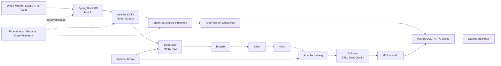

# 🛒 SmartRetail Data Platform

> Plataforma de Big Data e IA para análise de vendas, clientes e estoque em tempo real.


## 🎯 Objetivo

O **SmartRetail Data Platform** é um projeto de portfólio orientado a cenários reais de varejo. A proposta é demonstrar, de ponta a ponta, como eventos de vendas, clientes, produtos e estoque podem ser ingeridos, processados, armazenados, analisados e transformados em valor de negócio.

O projeto conecta **Backend Java**, **Engenharia de Dados**, **Big Data**, **Streaming**, **Lakehouse**, **Observabilidade** e **Machine Learning**.

## 🧠 Problema de negócio

Uma rede de varejo precisa acompanhar, em tempo real:

- vendas por minuto;
- ticket médio;
- produtos mais vendidos;
- comportamento de clientes;
- abandono de carrinho;
- estoque crítico;
- risco de ruptura;
- anomalias em transações;
- previsão de demanda.

## 🏗️ Arquitetura



## 🔄 Fluxo de dados

**Fontes → Spring Boot → Kafka → Spark → Data Lake/Lakehouse → PySpark → ML → API Analítica → Dashboard**

## 5️⃣ Os 5 Vs do Big Data no projeto

| Conceito | Aplicação |
|---|---|
| **Volume** | geração de grandes quantidades de eventos |
| **Velocity** | processamento em tempo real com Kafka e Spark |
| **Variety** | JSON, CSV, logs, APIs e eventos |
| **Veracity** | validação, deduplicação e Data Quality |
| **Value** | KPIs, previsões, alertas e insights de negócio |

## 🧰 Stack planejada

### Backend
- Java 21
- Spring Boot
- Spring Web
- Spring Data JPA
- Bean Validation
- Spring Actuator

### Streaming & Big Data
- Apache Kafka
- Apache Spark
- Spark Structured Streaming
- PySpark

### Data Engineering
- Apache Airflow
- MinIO / AWS S3
- Apache Iceberg
- Arquitetura Bronze / Silver / Gold

### Dados
- PostgreSQL
- Redis

### Machine Learning
- Python
- Pandas / NumPy
- Spark MLlib
- MLflow

### Frontend
- React
- Vite

### Infraestrutura e observabilidade
- Docker
- Docker Compose
- Kubernetes
- Prometheus
- Grafana
- OpenTelemetry

## 📁 Estrutura planejada

```text
smartretail-data-platform/
├── backend/
├── streaming/
├── data-engineering/
│   ├── airflow/
│   └── pyspark/
├── ml/
├── frontend/
├── infra/
│   ├── docker/
│   └── kubernetes/
├── docs/
├── .github/
├── docker-compose.yml
└── README.md
```

## 🚀 Roadmap

- **v0.1 — Event Platform**: Spring Boot + Kafka + PostgreSQL + Docker
- **v0.2 — Streaming Analytics**: Spark Structured Streaming
- **v0.3 — Data Lakehouse**: MinIO/S3 + Bronze/Silver/Gold + Iceberg
- **v0.4 — Data Engineering**: Airflow + PySpark + Data Quality
- **v0.5 — Analytics**: API analítica + Dashboard React
- **v0.6 — AI**: MLflow + previsão de demanda + detecção de anomalias

## 📌 Status

🚧 **Em desenvolvimento — início da v0.1**

## 👨‍💻 Autor

**Jucelio Coelho**  
Backend Java | Data Engineering | Big Data | Cloud | QA
