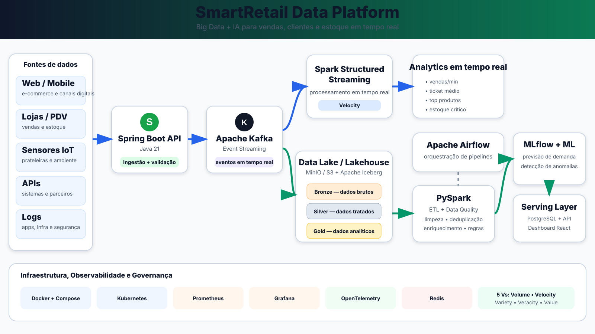

# 🛒 SmartRetail Data Platform

<p align="center">
  <strong>Plataforma orientada a eventos para varejo, construída com Java, Kafka, Spark e PostgreSQL, evoluindo para Lakehouse, Analytics e IA.</strong>
</p>

<p align="center">
  Projeto de portfólio focado em <strong>Backend Java, Engenharia de Dados, Event Streaming, Observabilidade e Machine Learning</strong>.
</p>

<p align="center">
  
  
  
  
  
  
  
  
  
  
</p>

---

## 📌 Visão geral

O **SmartRetail Data Platform** é uma plataforma de dados orientada a eventos criada para simular um cenário realista de varejo digital e físico.

O objetivo é demonstrar, de forma incremental, o ciclo completo do dado:

**geração → ingestão → streaming → processamento → armazenamento → qualidade → analytics → machine learning → consumo**

As releases v0.1 e v0.2 já implementam uma fatia vertical completa: ingestão transacional, publicação no Kafka e processamento analítico em tempo real com Spark Structured Streaming.

> **Status atual:** ✅ **v0.3 — Data Lakehouse concluída e validada.**
>
> ✅ Bronze implementada e validada com Spark + MinIO + Parquet  
> ✅ Silver implementada e validada com Spark + Parquet  
> ✅ Gold implementada e validada com Spark + Parquet  
> ✅ 15 testes PySpark validados nas camadas Streaming, Silver, Gold e Iceberg  
> ✅ Apache Iceberg integrado e validado com JDBC Catalog + MinIO  
> ✅ Snapshots e Time Travel validados: 4 → 5 registros  
> ✅ Schema Evolution validada sem recriar a tabela

---

## ✅ v0.1 — Event Platform

A v0.1 implementa uma arquitetura orientada a eventos com consistência transacional, idempotência e processamento assíncrono.

### Tecnologias implementadas

- **Java 21**
- **Spring Boot 3.5.5**
- Spring Web
- Spring Validation
- Spring Data JPA
- Apache Kafka 3.9.1
- PostgreSQL 17
- Flyway
- Spring Boot Actuator
- Micrometer + Prometheus
- Docker + Docker Compose
- JUnit 5
- Mockito
- MockMvc
- JaCoCo
- GitHub Actions

### Capacidades implementadas

- API REST para ingestão de eventos de pedidos
- validação de payload
- respostas HTTP com Problem Details
- suporte a **Idempotency-Key**
- persistência transacional de idempotência
- **Transactional Outbox Pattern**
- publicação assíncrona no Kafka
- tópico `smartretail.orders.v1`
- 3 partições
- retry no consumo
- Dead Letter Topic
- consumer idempotente
- controle de eventos já processados
- projeção de pedidos em PostgreSQL
- migrations versionadas com Flyway
- health checks
- métricas Prometheus
- testes automatizados
- relatório de cobertura com JaCoCo
- CI com Java 21 e Maven

---


## ✅ v0.2 — Streaming Analytics

A v0.2 conecta o tópico de pedidos ao **Apache Spark Structured Streaming** e transforma eventos em métricas de vendas em tempo real.

### Tecnologias implementadas

- Apache Spark 4.0.1
- PySpark
- Kafka Source
- Python
- Docker / Linux runtime
- `unittest`
- GitHub Actions

### Capacidades implementadas

- consumo do tópico `smartretail.orders.v1`;
- parsing tipado do contrato JSON;
- conversão de `occurredAt` em event time;
- watermark de 2 minutos;
- tumbling window de 1 minuto;
- agrupamento por canal;
- contagem de pedidos;
- soma de itens;
- cálculo de receita;
- checkpoints do Structured Streaming;
- execução reproduzível em Docker;
- testes automatizados das transformações;
- workflow `streaming-ci.yml`.

### Fluxo validado

```text
Spring Boot
    ↓
Transactional Outbox
    ↓
Kafka
    ↓
Spark Structured Streaming
    ↓
Event Time + Watermark
    ↓
1-minute Tumbling Window
    ↓
orders + items + revenue
```

Exemplo validado:

```text
channel = WEB
orders  = 1
items   = 3
revenue = 599.70
```

A suíte PySpark executada no runtime Spark concluiu:

```text
Ran 3 tests
OK
```

---

## ✅ v0.3 — Data Lakehouse

A v0.3 adiciona persistência analítica ao SmartRetail Data Platform utilizando **MinIO compatível com S3, Apache Spark, PySpark, Hadoop S3A, Parquet e Medallion Architecture**.

### Arquitetura atual

```text
Spring Boot
    ↓
Transactional Outbox
    ↓
Apache Kafka
    ↓
Spark Structured Streaming
    ↓
Bronze
Raw Kafka Events
Parquet + MinIO
    ↓
Spark Silver
    ↓
Parsing + Typing
Validation + Normalization
Deduplication
    ↓
Silver
Trusted Orders
Parquet + MinIO
    ↓
Gold
Analytics Data Products
✅ Implementada
```

### Bronze — implementada ✅

O Spark Structured Streaming consome o tópico:

```text
smartretail.orders.v1
```

e persiste os eventos brutos em:

```text
s3a://smartretail-bronze/orders/
```

A Bronze preserva informações importantes para auditoria e reprocessamento:

- payload JSON original;
- chave Kafka;
- tópico;
- partição;
- offset;
- timestamp Kafka;
- timestamp de ingestão;
- data de ingestão.

Os dados são armazenados em **Parquet com compressão Snappy** e particionados por:

```text
ingestionDate=YYYY-MM-DD
```

Exemplo validado:

```text
smartretail-bronze/
└── orders/
    ├── _spark_metadata/
    └── ingestionDate=2026-10-02/
        └── part-....snappy.parquet
```

### Silver — implementada ✅

A Silver lê exclusivamente os dados da Bronze:

```text
s3a://smartretail-bronze/orders/
```

e grava dados confiáveis em:

```text
s3a://smartretail-silver/orders/
```

Transformações realizadas:

```text
Raw JSON
   ↓
Schema
   ↓
Typing
   ↓
Validation
   ↓
Normalization
   ↓
Revenue Calculation
   ↓
Deduplication
   ↓
Silver
```

Regras implementadas:

- parsing do JSON;
- aplicação de schema explícito;
- conversão de `occurredAt` para timestamp;
- `eventId` obrigatório;
- `customerId` obrigatório;
- `productId` obrigatório;
- `quantity > 0`;
- `unitPrice >= 0`;
- normalização de `channel`;
- normalização de `location`;
- cálculo de `revenue`;
- criação de `eventDate`;
- deduplicação por `eventId`;
- preservação dos metadados Kafka.

Os dados Silver são particionados por:

```text
eventDate=YYYY-MM-DD
```

Exemplo:

```text
smartretail-silver/
└── orders/
    ├── _spark_metadata/
    ├── eventDate=2026-10-01/
    │   └── part-....snappy.parquet
    └── eventDate=2026-10-02/
        └── part-....snappy.parquet
```

### Testes Silver ✅

A camada Silver possui testes automatizados para parsing, normalização, cálculo de receita, validação de quantidade e preço, JSON malformado e deduplicação por `eventId`.

Resultado validado:

```text
Ran 5 tests in 47.436s

OK
```

### Gold — implementada ✅

A Gold é derivada exclusivamente da Silver e disponibiliza Data Products analíticos reconstruíveis.

Datasets:

```text
s3a://smartretail-gold/orders-daily/
s3a://smartretail-gold/orders-summary/
```

KPIs implementados:

- total de pedidos;
- total de itens;
- receita total;
- ticket médio;
- clientes únicos;
- produtos únicos;
- vendas por data;
- vendas por canal;
- vendas por localização.

A execução batch validada processou 4 pedidos, 12 itens e receita total de 2218.80, com ticket médio de 554.70.

A escrita utiliza `overwrite` sobre datasets derivados, permitindo reconstrução idempotente da camada Gold a partir da Silver.

### Testes PySpark ✅

Antes da integração Iceberg, as transformações Streaming/Silver/Gold totalizavam 10 testes validados:

```text
Streaming transforms: 3
Silver:               5
Gold:                 2
------------------------
Total:               10
```

Todos concluíram com `OK`.

A integração Iceberg adiciona 5 testes automatizados adicionais para identificadores de catálogo, descoberta de tabela, alinhamento de schema evoluído e comportamento de Time Travel.

```text
Streaming transforms:  3
Silver:                5
Gold:                  2
Iceberg:               5
-------------------------
Total geral:          15
```

O workflow `streaming-ci` concluiu com sucesso após a inclusão da suíte Iceberg.

### Buckets do Lakehouse

```text
smartretail-bronze
smartretail-silver
smartretail-gold
smartretail-warehouse
```

O bucket `smartretail-warehouse` armazena a tabela Apache Iceberg e seus arquivos de dados e metadata. O catálogo JDBC utiliza o PostgreSQL para registrar namespaces e tabelas.

### Stack da v0.3

- Apache Spark 4.0.1
- PySpark
- Spark Structured Streaming
- MinIO / S3 API
- Hadoop AWS / S3A
- Parquet
- Snappy
- Medallion Architecture
- Docker Compose
- Python `unittest`
- Apache Iceberg 1.11.0
- Iceberg JDBC Catalog
- PostgreSQL Catalog
- Iceberg snapshots e time travel
- Iceberg schema evolution

### Apache Iceberg — implementado e validado ✅

A Silver alimenta uma tabela Iceberg gerenciada:

```text
smartretail.lakehouse.orders
```

Warehouse:

```text
s3a://smartretail-warehouse/iceberg
```

Catálogo:

```text
Apache Iceberg JDBC Catalog
        ↓
PostgreSQL
├── iceberg_namespace_properties
└── iceberg_tables
```

O warehouse no MinIO contém arquivos Parquet e metadata Iceberg versionada.

Validações realizadas:

- criação da tabela Iceberg a partir da Silver;
- particionamento por `days(occurredAt)`;
- criação de snapshots;
- atualização da tabela com `INSERT OVERWRITE`;
- Time Travel por `VERSION AS OF`;
- Snapshot anterior com 4 registros;
- estado atual com 5 registros;
- Schema Evolution com adição de coluna sem recriar a tabela;
- nova versão de metadata `00002-....metadata.json`;
- preservação de colunas evoluídas em execuções posteriores do job.

```text
Bronze ✅
   ↓
Silver ✅
   ↓
Gold ✅
   ↓
Apache Iceberg ✅
   ├── JDBC Catalog ✅
   ├── Snapshots ✅
   ├── Time Travel ✅
   └── Schema Evolution ✅
```


---

## 🔄 Fluxo validado de ponta a ponta

```text
POST /api/v1/events/orders
          │
          ▼
   Spring Boot API
          │
          ├──► idempotency_record
          │
          └──► outbox_event
                     │
                     ▼
              Outbox Publisher
                     │
                     ▼
        smartretail.orders.v1
                     │
                     ▼
           Kafka Consumer
              │          │
              ▼          ▼
      processed_event   order_event_projection
                              │
                              ▼
             GET /api/v1/events/orders/{eventId}
```

O fluxo foi validado localmente com:

- criação de evento com HTTP `202 Accepted`;
- repetição da chamada com o mesmo `Idempotency-Key`;
- retorno do mesmo `eventId`;
- indicação `replayed=true`;
- publicação assíncrona no Kafka;
- consumo do evento;
- gravação da projeção;
- consulta posterior via endpoint GET.

---

## 🧠 Decisões arquiteturais

### Transactional Outbox

A API não publica diretamente no Kafka dentro da transação HTTP.

Em vez disso:

```text
Transação PostgreSQL
├── idempotency_record
└── outbox_event
```

Após o commit, o publisher lê o outbox e envia o evento ao Kafka.

Essa abordagem reduz o risco de inconsistência entre banco e broker.

### Idempotência na entrada

Chamadas repetidas com o mesmo `Idempotency-Key` retornam o mesmo evento em vez de gerar pedidos duplicados.

### Idempotência no consumer

A tabela `processed_event` registra os eventos já processados e protege a projeção contra reprocessamento duplicado.

### Retry + DLT

Falhas de consumo utilizam retry e, após as tentativas configuradas, o evento pode ser encaminhado para:

```text
smartretail.orders.v1.DLT
```

### Limitação consciente da v0.1

O polling do Transactional Outbox foi projetado para uma instância da aplicação.

Para escala horizontal, a evolução deverá utilizar uma estratégia de claim/locking, como `FOR UPDATE SKIP LOCKED`, ou CDC com Debezium.

---

## 🚀 Execução local

### Pré-requisitos

```text
Java 21
Maven 3.9+
Docker Desktop
Docker Compose
```

### Clonar o projeto

```bash
git clone https://github.com/juceliocoelho2022/smartretail-data-platform.git
cd smartretail-data-platform
```

### Subir PostgreSQL, Kafka, API, Spark e MinIO

```bash
docker compose up --build
```

### Portas locais

| Componente | Porta |
|---|---:|
| Spring Boot API | `8080` |
| PostgreSQL | `5433` |
| Kafka | `9092` |
| Spark Streaming / Bronze UI | `4040` |
| Spark Silver UI | `4041` |
| MinIO S3 API | `9000` |
| MinIO Console | `9001` |

Dentro da rede Docker, o PostgreSQL continua disponível na porta interna `5432`.

---

## 📨 Criar evento de pedido

```bash
curl -i -X POST http://localhost:8080/api/v1/events/orders \
  -H "Content-Type: application/json" \
  -H "Idempotency-Key: demo-order-001" \
  -d '{
    "customerId": "CUST-001",
    "productId": "PROD-001",
    "quantity": 2,
    "unitPrice": 149.90,
    "channel": "WEB",
    "location": "SAO_PAULO"
  }'
```

Exemplo de resposta:

```json
{
  "eventId": "21e31d5c-0c1a-41b5-9ff8-0772e44c8cfd",
  "status": "ACCEPTED",
  "replayed": false,
  "acceptedAt": "2026-09-30T22:08:59Z"
}
```

Repetindo a mesma chamada com o mesmo `Idempotency-Key`:

```json
{
  "eventId": "21e31d5c-0c1a-41b5-9ff8-0772e44c8cfd",
  "status": "ACCEPTED",
  "replayed": true
}
```

---

## 🔎 Consultar projeção

```bash
curl http://localhost:8080/api/v1/events/orders/{eventId}
```

Exemplo:

```json
{
  "eventId": "21e31d5c-0c1a-41b5-9ff8-0772e44c8cfd",
  "customerId": "CUST-001",
  "productId": "PROD-001",
  "quantity": 2,
  "unitPrice": 149.90,
  "channel": "WEB",
  "location": "SAO_PAULO",
  "occurredAt": "2026-09-30T22:08:59Z",
  "processedAt": "2026-09-30T22:09:00Z"
}
```

Como o processamento é assíncrono, o GET pode retornar `404` por alguns instantes antes da projeção ser criada.

---

## ❤️ Health e métricas

### Health

```bash
curl http://localhost:8080/actuator/health
```

### Prometheus

```bash
curl http://localhost:8080/actuator/prometheus
```

---

## 🧪 Testes

A v0.1 possui testes automatizados para as principais responsabilidades da API.

### Executar testes

```bash
cd backend/ingestion-api
mvn clean test
```

### Executar validação completa

```bash
mvn clean verify
```

### Relatório JaCoCo

Após o `verify`:

```text
backend/ingestion-api/target/site/jacoco/index.html
```

Cobertura atual é utilizada como instrumento de inspeção. O quality gate mínimo será introduzido conforme a suíte de testes crescer.

---

## ⚙️ CI — GitHub Actions

Os workflows principais são:

```text
.github/workflows/backend-ci.yml
.github/workflows/streaming-ci.yml
```

O backend executa Java 21 + Maven + `mvn -B verify`. O streaming configura Java/Python, instala PySpark, executa a suíte de transformações e valida o Docker Compose.

As releases v0.1 e v0.2 foram integradas à `main` após seus pipelines concluírem com sucesso.

---

## 📚 Documentação técnica

- [Exemplos da API](docs/API_EXAMPLES.md)
- [Implementação da v0.1](docs/V0.1_IMPLEMENTATION.md)
- [Arquitetura](docs/ARCHITECTURE.md)
- [Roadmap](docs/ROADMAP.md)

---

## 🏗️ Arquitetura alvo da plataforma

<p align="center">
  
</p>

```text
Web / Mobile / PDV / APIs
          │
          ▼
 Spring Boot — Java 21
          │
          ▼
      Apache Kafka
       /        \
      /          \
     ▼            ▼
Spark Structured   Data Lakehouse
Streaming          MinIO/S3 + Iceberg
     │                    │
     ▼                    ▼
Real-time KPIs      Bronze → Silver → Gold
                           │
                           ▼
                        PySpark
                           │
                           ▼
                     MLflow + ML
                           │
                 ┌─────────┴─────────┐
                 ▼                   ▼
          Analytics API        Data Products
                 │
                 ▼
          Dashboard React
```

A Event Platform (v0.1), o Streaming Analytics (v0.2) e o Data Lakehouse (v0.3) estão implementados e validados.

---

## 🎯 Casos de uso planejados

A plataforma evoluirá para responder perguntas como:

- Qual é a receita por minuto?
- Qual é o ticket médio por canal?
- Quais produtos possuem maior volume de vendas?
- Quais produtos apresentam risco de ruptura?
- Qual região possui maior conversão?
- Existem transações ou eventos anômalos?
- Qual é a demanda prevista para as próximas horas ou dias?

---

## 5️⃣ Big Data — os 5 Vs

| V | Aplicação no projeto |
|---|---|
| **Volume** | processamento de grandes quantidades de eventos de varejo |
| **Velocity** | ingestão contínua com Kafka e processamento com Spark |
| **Variety** | JSON, CSV, logs, dados relacionais, APIs e telemetria |
| **Veracity** | validação, deduplicação, consistência e Data Quality |
| **Value** | KPIs, alertas, previsões e suporte à decisão |

---

## 🏞️ Data Lakehouse — v0.3 concluída

A v0.3 implementa a **Medallion Architecture** sobre MinIO/S3.

### Bronze ✅

Dados brutos e imutáveis provenientes do Kafka.

```text
Kafka
 ↓
Spark Structured Streaming
 ↓
s3a://smartretail-bronze/orders/
```

Finalidade:

- auditoria;
- replay;
- rastreabilidade;
- reconstrução das camadas posteriores.

### Silver ✅

Dados tratados e confiáveis derivados da Bronze.

```text
Bronze
 ↓
Parse
 ↓
Validation
 ↓
Normalization
 ↓
Deduplication
 ↓
Silver
```

Destino:

```text
s3a://smartretail-silver/orders/
```

### Gold ✅

Dados preparados para consumo analítico.

Data Products implementados:

```text
orders-daily
orders-summary
```

A Gold disponibiliza KPIs prontos para futuras APIs, dashboards e modelos de Machine Learning.

### Iceberg ✅

A tabela `smartretail.lakehouse.orders` utiliza Apache Iceberg com catálogo JDBC no PostgreSQL e warehouse no MinIO:

```text
s3a://smartretail-warehouse/iceberg
```

Foram validados snapshots, Time Travel e Schema Evolution.

---

## 🔁 Data Engineering — roadmap

A camada de engenharia de dados deverá evoluir com:

- Apache Airflow
- PySpark
- Data Quality
- retries
- scheduling
- SLAs
- logs
- alertas
- pipelines Bronze → Silver → Gold

---

## 🤖 Machine Learning — roadmap

Casos de uso previstos:

- previsão de demanda;
- detecção de anomalias;
- risco de ruptura de estoque;
- análise de comportamento transacional.

O MLflow será utilizado para rastreamento de experimentos, métricas, artefatos e modelos.

---

## 🔭 Observabilidade

### Implementado na v0.1

- Spring Boot Actuator
- Micrometer
- endpoint Prometheus
- logs da aplicação

### Evolução planejada

- Prometheus server
- Grafana
- OpenTelemetry
- tracing distribuído
- correlação entre logs, métricas e traces

---

## 🛡️ Segurança e governança

Princípios adotados:

- nenhum segredo real versionado no repositório;
- configuração por variáveis de ambiente;
- segregação entre configuração local e código;
- evolução futura para autenticação e autorização;
- princípio do menor privilégio;
- auditoria;
- retenção e lineage.

---

## 🧰 Stack tecnológica

| Área | Tecnologias |
|---|---|
| Backend | Java 21, Spring Boot 3.5.5 |
| API | REST, Validation, Problem Details |
| Persistência | PostgreSQL 17, Spring Data JPA |
| Streaming | Apache Kafka 3.9.1 |
| Resiliência | Retry, DLT, Idempotência |
| Mensageria | Transactional Outbox |
| Schema | Flyway |
| Observabilidade | Actuator, Micrometer, Prometheus |
| Testes | JUnit 5, Mockito, MockMvc, JaCoCo |
| Containers | Docker, Docker Compose |
| CI | GitHub Actions |
| Big Data | Apache Spark 4.0.1, PySpark, Structured Streaming |
| Data Engineering | PySpark, Structured Streaming, S3A, Medallion Architecture; Airflow — v0.4 |
| Lakehouse | MinIO/S3, Parquet, Bronze, Silver, Gold e Apache Iceberg com JDBC Catalog, snapshots, Time Travel e Schema Evolution |
| ML | MLflow — roadmap |
| Frontend | React/Vite — roadmap |

---

## 📁 Estrutura do projeto

```text
smartretail-data-platform/
├── backend/
│   └── ingestion-api/
│       ├── src/main/java/
│       ├── src/main/resources/
│       │   └── db/migration/
│       ├── src/test/java/
│       ├── Dockerfile
│       └── pom.xml
├── streaming/
│   └── spark-streaming/
│       ├── src/main/python/
│       ├── src/test/python/
│       └── README.md
├── lakehouse/
│   └── README.md
├── docs/
│   ├── assets/
│   ├── API_EXAMPLES.md
│   ├── ARCHITECTURE.md
│   ├── ROADMAP.md
│   └── V0.1_IMPLEMENTATION.md
├── .github/
│   └── workflows/
│       ├── backend-ci.yml
│       └── streaming-ci.yml
├── .env.example
├── docker-compose.yml
├── LICENSE
└── README.md
```

A estrutura cresce junto com as releases; o repositório não apresenta componentes de roadmap como se já estivessem implementados.

---

## 🚀 Roadmap

| Release | Entrega | Status |
|---|---|---|
| **v0.1** | Event Platform — Spring Boot + Kafka + PostgreSQL + Docker | ✅ Concluída |
| **v0.2** | Streaming Analytics — Spark Structured Streaming | ✅ Concluída |
| **v0.3** | Data Lakehouse — MinIO/S3 + Bronze/Silver/Gold + Iceberg | ✅ Concluída |
| **v0.4** | Data Engineering — Airflow + PySpark + Data Quality | ⏳ Planejada |
| **v0.5** | Analytics — API + Dashboard React | ⏳ Planejada |
| **v0.6** | AI — MLflow + previsão de demanda + anomalias | ⏳ Planejada |

---

## 🎓 Competências demonstradas

As releases v0.1 e v0.2 e os incrementos já validados da v0.3 demonstram, na prática:

- desenvolvimento backend com Java 21;
- Spring Boot;
- desenho de APIs REST;
- arquitetura orientada a eventos;
- Apache Kafka;
- Apache Spark Structured Streaming;
- PySpark;
- event time, watermark e janelas;
- processamento de métricas em tempo real;
- Data Lakehouse;
- Medallion Architecture;
- MinIO / S3;
- Hadoop S3A;
- Parquet;
- Schema Evolution;
- snapshots e Time Travel;
- Iceberg JDBC Catalog;
- Apache Iceberg;
- camada Bronze para eventos brutos e reprocessáveis;
- camada Silver para dados confiáveis;
- parsing e schema explícito;
- normalização de dados;
- deduplicação de eventos;
- Data Quality;
- testes automatizados de pipelines PySpark;
- Transactional Outbox;
- idempotência;
- processamento assíncrono;
- persistência com PostgreSQL;
- versionamento de schema com Flyway;
- testes automatizados;
- cobertura de código;
- CI;
- Docker;
- observabilidade;
- documentação técnica;
- evolução incremental de arquitetura.

---

## 📐 Princípios de engenharia

1. **Clareza antes de complexidade**
2. **Contratos explícitos**
3. **Idempotência**
4. **Baixo acoplamento**
5. **Observabilidade by design**
6. **Automação de testes**
7. **Infraestrutura reproduzível**
8. **Dados confiáveis antes de IA**
9. **Documentação junto com o código**
10. **Evolução incremental**

---

## 📄 Licença

Distribuído sob a licença **MIT**. Consulte [LICENSE](LICENSE).

---

## 👨‍💻 Autor

**Jucelio Coelho**

Backend Java • Engenharia de Dados • Big Data • Cloud • QA

GitHub: [@juceliocoelho2022](https://github.com/juceliocoelho2022)

---

<p align="center">
  <strong>SmartRetail Data Platform</strong><br>
  Do evento ao insight — arquitetura orientada a dados, streaming e geração de valor.
</p>
